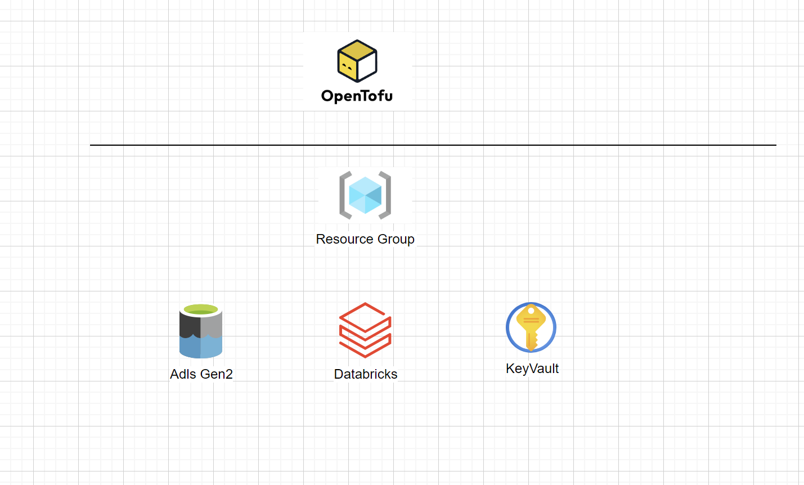
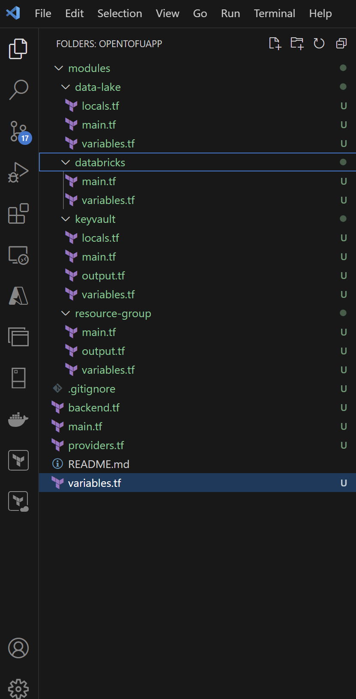
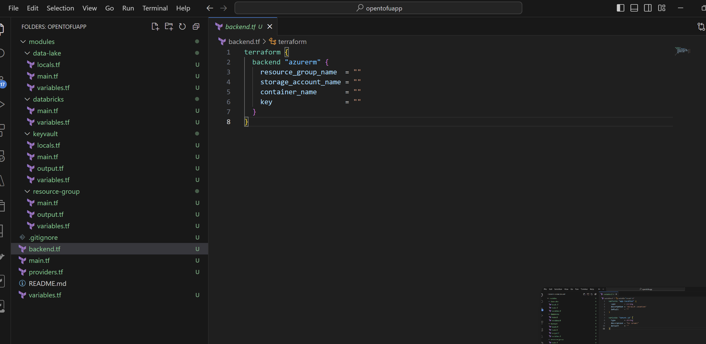
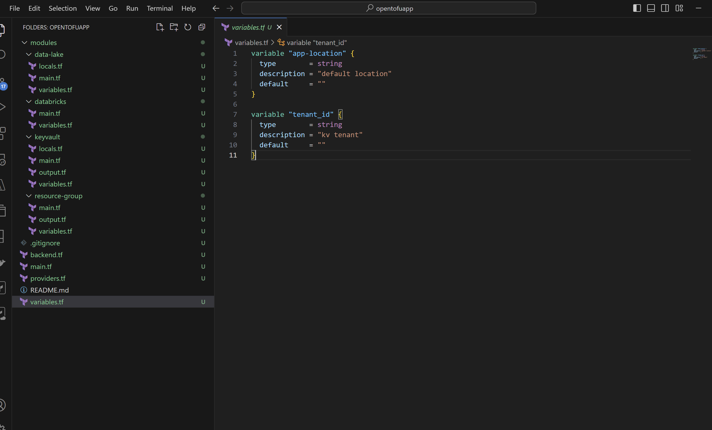

# IaC using OpenTofu

OpenTofu documentation can be found at:

https://opentofu.org/

Tofu installation steps at:

https://opentofu.org/docs/intro/install/

Setting-up backend with Azure

https://opentofu.org/docs/language/settings/backends/azurerm/

### What are you going to build:

### Project setup

Tofu IaC code are built on modules (best practices)

### Backend setup

Azure storage account is chosen for the app backend. Please feel free to remove this file if you want to
setup backend locally (not advisable for production grade deployments)

### Variables setup

Variable names are self explanatory. Please fill in all the necessary details.

### Deployment to Azure

 * Authentication your Azure account using az login (and a tenant)

 * tofu init 

 * tofu validate

 * tofu plan 

 * tofu apply 

 * tofu destroy